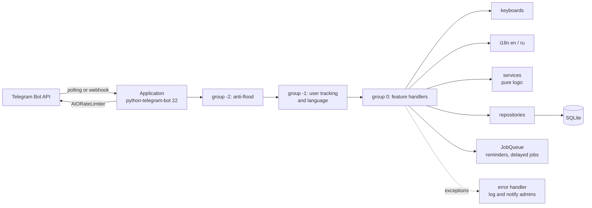

# Staery Demo Bot

**English** · [Русский](README.ru.md)

[](https://github.com/Staery/staery_demo_bot/actions/workflows/ci.yml)
[](https://www.python.org)
[](https://python-telegram-bot.org)
[](https://github.com/astral-sh/ruff)
[](LICENSE)

A Telegram bot that shows how much of the Telegram Bot API you can use from Python.
Every feature is a small, documented module that you can read on its own.
The bot is built on **python-telegram-bot 22** (asyncio), stores its data in **SQLite**,
speaks **English and Russian**, has **185 tests** that run offline, and ships with **Docker** and **CI**.

---

## Features

| | Feature | Where to look | Bot API used |
|---|---|---|---|
| 🚀 | `/start` with deep-link payloads: referrals `ref_<id>`, catalogue cards `item_<id>`, the feedback form `feedback` | `handlers/start.py`, `services/deep_links.py` | deep links |
| 📋 | Command menu per language, plus an extra admin-only menu | `commands.py` | `setMyCommands` with scopes and `language_code`, `setMyDescription` |
| ⌨️ | Persistent reply keyboard with "send location" and "share contact" buttons | `keyboards/reply.py` | `ReplyKeyboardMarkup`, `request_location`, `request_contact` |
| 🛍 | Catalogue with inline buttons and pagination; pages are edited in place | `handlers/catalog.py`, `services/pagination.py` | `InlineKeyboardMarkup`, `editMessageText` |
| 📝 | 4-step feedback form: input validation, `/skip`, `/cancel`, a 10-minute timeout, a review step before sending, and a notice to admins | `handlers/feedback.py`, `services/validators.py` | `ConversationHandler` |
| 🖼 | Sends a photo (replaceable in place), an album, an in-memory file, a location, a venue and a contact | `handlers/media.py` | `sendPhoto`, `editMessageMedia`, `sendMediaGroup`, `sendDocument`, `sendLocation`, `sendVenue`, `sendContact` |
| 🎲 | Dice and other mini-games; the bot announces the result after the animation ends | `handlers/media.py` | `sendDice`, JobQueue |
| 📊 | Regular polls (the bot tracks each answer) and quiz polls with explanations | `handlers/media.py`, `services/quiz.py` | `sendPoll`, `PollAnswer` |
| 📥 | Reads incoming photos (sends them back by `file_id`), documents, voice messages, stickers, locations (with the distance to the Eiffel Tower) and contacts | `handlers/media.py` | message filters |
| 🔎 | Inline mode: formats your text and searches the catalogue | `handlers/inline_mode.py` | `answerInlineQuery`, `InlineQueryResultsButton` |
| ✏️ | Message editing, deletion and chat actions (`/countdown`, `/selfdestruct`, `/typing`) | `handlers/effects.py` | `editMessageText`, `deleteMessages`, `sendChatAction` |
| ⏰ | `/remind 1h 30m text`: reminders are saved in SQLite, scheduled again after a restart, and can be snoozed | `handlers/reminders.py`, `services/durations.py` | JobQueue (APScheduler) |
| 🌐 | English and Russian. The bot uses the language of the user's Telegram app, and `/settings` lets them pick another | `i18n/`, `handlers/settings.py` | `language_code` |
| 💾 | SQLite storage for users, settings, referrals, feedback, reminders and payments, with versioned migrations | `storage/` | — |
| 🛡 | Admin commands: `/stats`, and `/broadcast` with a confirmation step (also copies any message you reply to); admins are set by `ADMIN_IDS` | `handlers/admin.py` | `copyMessage`, `filters.User` |
| 🐢 | Two rate limits: anti-flood for incoming updates (sliding window, the user is warned once), and `AIORateLimiter` for outgoing calls | `middlewares/`, `services/rate_limiter.py` | `ApplicationHandlerStop` |
| ⭐ | Donations in Telegram Stars: invoice, pre-checkout check, recorded payment | `handlers/payments.py` | `sendInvoice` (`XTR`), `PreCheckoutQuery` |
| 👥 | Welcome messages in groups; the bot notices when a user blocks or unblocks it | `handlers/groups.py` | `my_chat_member` |
| 🚨 | Global error handler: logs the traceback, apologises to the user and sends a report to the admins | `handlers/errors.py` | `add_error_handler` |
| 🔌 | Long polling or webhook, chosen with one environment variable (the webhook has a secret token) | `app.py` | `run_polling` / `run_webhook` |

## Commands

| Command | Description |
|---|---|
| `/start` | Greeting, reply keyboard and inline main menu (also handles deep links) |
| `/menu` | Inline main menu |
| `/help` | List of commands (admins also see the admin commands) |
| `/catalog` | Paginated catalogue of Python libraries |
| `/feedback` | Multi-step feedback form |
| `/media` | Menu: photo, album, document, location, venue, contact, poll, quiz, dice |
| `/photo` | Random photo with a "replace" button |
| `/dice [emoji]` | 🎲 🎯 🏀 ⚽ 🎳 🎰 |
| `/poll`, `/quiz` | Regular poll and quiz poll |
| `/remind <time> <text>` | Reminder, e.g. `/remind 10m tea`, `/remind 1h 30m call mom`, `/remind 2д оплатить` |
| `/reminders` | Pending reminders with delete buttons |
| `/countdown` | Edits one message several times |
| `/typing` | Shows the "typing…" status |
| `/selfdestruct [seconds]` | Message that deletes itself |
| `/invite` | Personal referral link and the number of invited friends |
| `/donate` | Support with Telegram Stars |
| `/settings` | Interface language |
| `/cancel` | Cancel the current dialog |
| `/stats` 🛡 | Users, activity, languages, feedback, reminders, Stars, uptime |
| `/broadcast <text>` 🛡 | Message every user (asks for confirmation first) |

### Example dialogs

```text
You:  /remind 1h 30m stretch
Bot:  ⏰ Reminder #3 set: in 1h 30m (2026-10-03 19:30 UTC).
      … 90 minutes later …
Bot:  ⏰ Reminder
      stretch                                  [😴 Snooze 10 min]
```

```text
You:  /feedback
Bot:  📝 Feedback (step 1/4) What is your name?   [Ann Lee] [✖️ Cancel]
You:  R2D2
Bot:  ⚠️ The name may only contain letters, spaces, hyphens and apostrophes.
You:  Ann Lee
Bot:  📧 Step 2/4: your e-mail? Send /skip if you prefer not to share it.
You:  /skip
Bot:  ⭐ Step 3/4: how do you rate this bot?   [⭐] [⭐⭐] [⭐⭐⭐] [⭐⭐⭐⭐] [⭐⭐⭐⭐⭐]
…
Bot:  🙏 Thank you! Your feedback #1 has been saved.
```

## Architecture



* **Middlewares.** python-telegram-bot runs handler groups in ascending order. A `TypeHandler(Update)` in a
  negative group therefore sees every update before the feature handlers do. It can stop an update by raising
  `ApplicationHandlerStop` (this is how anti-flood works), or it can add data to the update (user tracking
  stores the user's language).
* **Typed context.** `BotContext` extends `CallbackContext` with `context.services` (settings and repositories)
  and `context.t("key")`, which translates a key into the current user's language.
* **Services do not depend on Telegram.** Duration parsing, pagination, validators, the rate limiter and
  deep-link parsing are plain Python, so unit tests cover them easily.
* **All SQL is in the repositories.** Handlers never write SQL. The schema is versioned with `PRAGMA user_version`.
* **Callback data** uses the compact `feature:action:arg` format, and each value is checked against Telegram's 64-byte limit.

## Project layout

```text
.
├── bot/
│   ├── __main__.py          # python -m bot
│   ├── app.py               # application factory, startup/shutdown, polling or webhook
│   ├── config.py            # pydantic-settings: environment variables and .env
│   ├── context.py           # BotContext and the Services container
│   ├── commands.py          # command registry: command menu and /help
│   ├── handlers/            # one module per feature
│   │   ├── start.py  catalog.py  feedback.py  media.py  inline_mode.py
│   │   ├── effects.py  reminders.py  settings.py  admin.py  payments.py
│   │   └── groups.py  errors.py  fallback.py  common.py
│   ├── middlewares/         # anti_flood.py, user_tracking.py
│   ├── keyboards/           # reply.py, inline.py, callbacks.py
│   ├── services/            # durations, pagination, validators, rate_limiter, deep_links, ...
│   ├── storage/             # database.py (migrations), repositories.py, models.py
│   └── i18n/                # Translator and locales/en.json, locales/ru.json
├── tests/                   # pytest suite and fake_telegram.py (offline Bot API)
├── .github/workflows/ci.yml # ruff and pytest on Python 3.12
├── Dockerfile
├── docker-compose.yml
├── Makefile
├── pyproject.toml           # ruff and pytest configuration
├── requirements.txt         # pinned runtime dependencies
├── requirements-dev.txt     # adds pytest, pytest-asyncio and ruff
└── .env.example
```

## Getting started

### 1. Create a bot

1. Open [@BotFather](https://t.me/BotFather), send `/newbot` and copy the token.
2. *(Optional)* Send `/setinline` to turn on inline mode.
3. *(Optional)* Get your numeric user ID, for example from [@userinfobot](https://t.me/userinfobot), so you can use the admin commands.

Telegram Stars payments need no payment provider and no extra setup.

### 2. Configure

```bash
cp .env.example .env
# then edit .env: TELEGRAM_BOT_TOKEN=..., ADMIN_IDS=123456789
```

| Variable | Default | Description |
|---|---|---|
| `TELEGRAM_BOT_TOKEN` | — | Token from @BotFather (**required**) |
| `ADMIN_IDS` | *(empty)* | Comma-separated Telegram user IDs that can use the admin commands |
| `DEFAULT_LANGUAGE` | `en` | Used when the user's Telegram language is not supported (`en` or `ru`) |
| `DATABASE_PATH` | `data/bot.sqlite3` | SQLite file (the directory is created automatically) |
| `LOG_LEVEL` | `INFO` | `DEBUG`, `INFO`, `WARNING`, `ERROR` |
| `RATE_LIMIT_MESSAGES` / `RATE_LIMIT_PERIOD` | `6` / `4` | Anti-flood: at most N updates every P seconds per user |
| `MODE` | `polling` | `polling` or `webhook` |
| `WEBHOOK_URL` | — | Public HTTPS base URL (required when `MODE=webhook`) |
| `WEBHOOK_PATH` / `WEBHOOK_SECRET` | `telegram` / — | URL path and secret token that Telegram checks |
| `WEBHOOK_LISTEN` / `WEBHOOK_PORT` | `0.0.0.0` / `8080` | Address and port of the built-in webhook server |

`.env` is listed in `.gitignore`. Never commit your token.

### 3. Run locally

```bash
python3 -m venv .venv && source .venv/bin/activate
pip install -r requirements-dev.txt
python -m bot
```

### 4. Run with Docker

```bash
docker compose up -d --build
docker compose logs -f bot
```

The SQLite database is stored in the `bot-data` named volume, so it survives container rebuilds.

### Webhook mode

Set `MODE=webhook` and `WEBHOOK_URL=https://bot.example.com`, and optionally `WEBHOOK_SECRET`.
Put a TLS-terminating reverse proxy in front of the bot and forward `/<WEBHOOK_PATH>` to port `8080`
(in `docker-compose.yml`, uncomment the `ports` section). The bot registers the webhook itself when it starts.

## Testing

```bash
pytest                 # 185 tests, about 4 seconds, no network access
ruff check .           # lint
ruff format --check .  # formatting
```

* **Unit tests** cover the pure logic: durations, i18n lookups and locale completeness, pagination, the rate
  limiter (with a fake clock), validators, settings parsing, callback data, deep links and helpers.
* **Repository tests** run against a temporary SQLite file.
* **End-to-end tests** send real `Update` objects through the fully wired application. `tests/fake_telegram.py`
  replaces python-telegram-bot's HTTP transport with an in-memory fake Bot API that records every call.
  These tests cover the feedback conversation, deep links, pagination, language switching, reminders,
  broadcasts, anti-flood, inline mode, Stars checkout and the error handler, all without touching Telegram.

The same checks run in GitHub Actions (`.github/workflows/ci.yml`).

## What changed compared to the first version

The first version was one synchronous script for python-telegram-bot **v13**. That API no longer works with
current releases. The script registered handlers that did not exist (`handlers.help`, `handlers.random_image`),
used an image API that has since been shut down, and had all its texts hard-coded in Russian. Version 2 is a
rewrite:

* migrated to **python-telegram-bot 22** (asyncio, `Application`, `ContextTypes`, `Defaults`, `AIORateLimiter`);
* split into a package with a module per feature, middlewares, keyboards, services, storage and i18n;
* added validated configuration (pydantic-settings) and a `.env.example`;
* added SQLite persistence, English and Russian translations, admin commands, reminders, payments, inline mode and more;
* added 185 offline tests, ruff, Docker, docker compose and a CI workflow;
* kept the original ideas: the welcome message for new group members and a random photo, now `/photo`.

## License

[MIT](LICENSE) © 2023–2026 Staery
