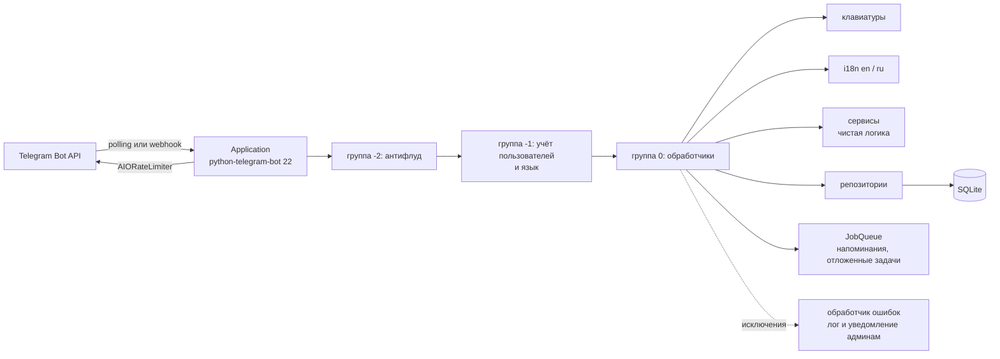

# Staery Demo Bot

[English](README.md) · **Русский**

[](https://github.com/Staery/staery_demo_bot/actions/workflows/ci.yml)
[](https://www.python.org)
[](https://python-telegram-bot.org)
[](https://github.com/astral-sh/ruff)
[](LICENSE)

Telegram-бот, который показывает, какую часть Telegram Bot API можно использовать из Python.
Каждая возможность — это небольшой документированный модуль, который можно читать отдельно от остальных.
Бот написан на **python-telegram-bot 22** (asyncio), хранит данные в **SQLite**, говорит
**по-русски и по-английски**, покрыт **185 тестами**, которые работают без сети, и поставляется с **Docker** и **CI**.

---

## Возможности

| | Возможность | Где смотреть | Что из Bot API |
|---|---|---|---|
| 🚀 | `/start` с параметрами deep link: рефералы `ref_<id>`, карточки каталога `item_<id>`, форма отзыва `feedback` | `handlers/start.py`, `services/deep_links.py` | deep links |
| 📋 | Меню команд на каждом языке и отдельное меню для администраторов | `commands.py` | `setMyCommands` со scope и `language_code`, `setMyDescription` |
| ⌨️ | Постоянная reply-клавиатура с кнопками «отправить геопозицию» и «поделиться контактом» | `keyboards/reply.py` | `ReplyKeyboardMarkup`, `request_location`, `request_contact` |
| 🛍 | Каталог с inline-кнопками и пагинацией; страницы меняются в том же сообщении | `handlers/catalog.py`, `services/pagination.py` | `InlineKeyboardMarkup`, `editMessageText` |
| 📝 | Форма отзыва из 4 шагов: проверка ввода, `/skip`, `/cancel`, таймаут 10 минут, проверка перед отправкой, уведомление администраторам | `handlers/feedback.py`, `services/validators.py` | `ConversationHandler` |
| 🖼 | Отправка фото (его можно заменить на месте), альбома, файла из памяти, геопозиции, места и контакта | `handlers/media.py` | `sendPhoto`, `editMessageMedia`, `sendMediaGroup`, `sendDocument`, `sendLocation`, `sendVenue`, `sendContact` |
| 🎲 | Кубик и другие мини-игры; бот сообщает результат, когда анимация закончится | `handlers/media.py` | `sendDice`, JobQueue |
| 📊 | Обычные опросы (бот отслеживает каждый ответ) и викторины с пояснением | `handlers/media.py`, `services/quiz.py` | `sendPoll`, `PollAnswer` |
| 📥 | Разбор входящих фото (бот возвращает их по `file_id`), документов, голосовых, стикеров, геопозиций (с расстоянием до Эйфелевой башни) и контактов | `handlers/media.py` | фильтры сообщений |
| 🔎 | Inline-режим: форматирует ваш текст и ищет по каталогу | `handlers/inline_mode.py` | `answerInlineQuery`, `InlineQueryResultsButton` |
| ✏️ | Редактирование и удаление сообщений, статусы чата (`/countdown`, `/selfdestruct`, `/typing`) | `handlers/effects.py` | `editMessageText`, `deleteMessages`, `sendChatAction` |
| ⏰ | `/remind 1ч 30мин текст`: напоминания сохраняются в SQLite, снова планируются после перезапуска, их можно отложить | `handlers/reminders.py`, `services/durations.py` | JobQueue (APScheduler) |
| 🌐 | Русский и английский. Бот берёт язык из приложения Telegram, а в `/settings` можно выбрать другой | `i18n/`, `handlers/settings.py` | `language_code` |
| 💾 | Хранение в SQLite: пользователи, настройки, рефералы, отзывы, напоминания и платежи; миграции с версиями | `storage/` | — |
| 🛡 | Команды администратора: `/stats` и `/broadcast` с подтверждением (умеет копировать сообщение, на которое вы ответили); администраторы задаются в `ADMIN_IDS` | `handlers/admin.py` | `copyMessage`, `filters.User` |
| 🐢 | Два ограничения частоты: антифлуд для входящих апдейтов (скользящее окно, предупреждение один раз) и `AIORateLimiter` для исходящих запросов | `middlewares/`, `services/rate_limiter.py` | `ApplicationHandlerStop` |
| ⭐ | Пожертвования в Telegram Stars: счёт, проверка pre-checkout, запись платежа | `handlers/payments.py` | `sendInvoice` (`XTR`), `PreCheckoutQuery` |
| 👥 | Приветствие в группах; бот замечает, когда пользователь его блокирует или разблокирует | `handlers/groups.py` | `my_chat_member` |
| 🚨 | Глобальный обработчик ошибок: пишет traceback в лог, извиняется перед пользователем и присылает отчёт администраторам | `handlers/errors.py` | `add_error_handler` |
| 🔌 | Long polling или webhook — выбирается одной переменной окружения (у webhook есть секретный токен) | `app.py` | `run_polling` / `run_webhook` |

## Команды

| Команда | Описание |
|---|---|
| `/start` | Приветствие, reply-клавиатура и inline-меню (здесь же обрабатываются deep link) |
| `/menu` | Главное inline-меню |
| `/help` | Список команд (администратор видит и свои команды) |
| `/catalog` | Каталог библиотек Python с пагинацией |
| `/feedback` | Многошаговая форма отзыва |
| `/media` | Меню: фото, альбом, документ, геопозиция, место, контакт, опрос, викторина, кубики |
| `/photo` | Случайное фото с кнопкой «заменить» |
| `/dice [эмодзи]` | 🎲 🎯 🏀 ⚽ 🎳 🎰 |
| `/poll`, `/quiz` | Обычный опрос и викторина |
| `/remind <время> <текст>` | Напоминание, например `/remind 10m чай`, `/remind 1ч 30мин позвонить маме`, `/remind 2д оплатить` |
| `/reminders` | Активные напоминания с кнопками удаления |
| `/countdown` | Несколько раз редактирует одно сообщение |
| `/typing` | Показывает статус «печатает…» |
| `/selfdestruct [секунды]` | Сообщение, которое удалит само себя |
| `/invite` | Личная реферальная ссылка и число приглашённых друзей |
| `/donate` | Поддержать звёздами Telegram |
| `/settings` | Язык интерфейса |
| `/cancel` | Отменить текущий диалог |
| `/stats` 🛡 | Пользователи, активность, языки, отзывы, напоминания, Stars, аптайм |
| `/broadcast <текст>` 🛡 | Сообщение всем пользователям (сначала просит подтверждение) |

### Примеры диалогов

```text
Вы:   /remind 1ч 30мин размяться
Бот:  ⏰ Напоминание №3 создано: через 1ч 30мин (2026-10-03 19:30 UTC).
      … через 90 минут …
Бот:  ⏰ Напоминание
      размяться                                [😴 Отложить на 10 мин]
```

```text
Вы:   /feedback
Бот:  📝 Обратная связь (шаг 1/4) Как вас зовут?   [Анна Ли] [✖️ Отмена]
Вы:   R2D2
Бот:  ⚠️ Имя может содержать только буквы, пробелы, дефисы и апострофы.
Вы:   Анна Ли
Бот:  📧 Шаг 2/4: ваш e-mail? Отправьте /skip, если не хотите его указывать.
Вы:   /skip
Бот:  ⭐ Шаг 3/4: как вы оцениваете бота?   [⭐] [⭐⭐] [⭐⭐⭐] [⭐⭐⭐⭐] [⭐⭐⭐⭐⭐]
…
Бот:  🙏 Спасибо! Отзыв №1 сохранён.
```

## Архитектура



* **Middleware.** python-telegram-bot запускает группы обработчиков по возрастанию номера. Поэтому
  `TypeHandler(Update)` в отрицательной группе видит каждый апдейт раньше обработчиков возможностей. Он может
  остановить апдейт через `ApplicationHandlerStop` (так работает антифлуд) или добавить к нему данные (учёт
  пользователей сохраняет язык пользователя).
* **Типизированный контекст.** `BotContext` расширяет `CallbackContext`: в нём есть `context.services`
  (настройки и репозитории) и `context.t("key")`, который переводит ключ на язык текущего пользователя.
* **Сервисы не зависят от Telegram.** Разбор длительностей, пагинация, валидаторы, ограничитель частоты и разбор
  deep link написаны на обычном Python, поэтому их легко покрыть модульными тестами.
* **Весь SQL находится в репозиториях.** Обработчики не пишут SQL. Версия схемы хранится в `PRAGMA user_version`.
* **Callback data** записывается в компактном формате `feature:action:arg`, и каждое значение проверяется на лимит Telegram в 64 байта.

## Структура проекта

```text
.
├── bot/
│   ├── __main__.py          # python -m bot
│   ├── app.py               # фабрика приложения, запуск/остановка, polling или webhook
│   ├── config.py            # pydantic-settings: переменные окружения и .env
│   ├── context.py           # BotContext и контейнер Services
│   ├── commands.py          # реестр команд: меню команд и /help
│   ├── handlers/            # по модулю на каждую возможность
│   │   ├── start.py  catalog.py  feedback.py  media.py  inline_mode.py
│   │   ├── effects.py  reminders.py  settings.py  admin.py  payments.py
│   │   └── groups.py  errors.py  fallback.py  common.py
│   ├── middlewares/         # anti_flood.py, user_tracking.py
│   ├── keyboards/           # reply.py, inline.py, callbacks.py
│   ├── services/            # durations, pagination, validators, rate_limiter, deep_links, ...
│   ├── storage/             # database.py (миграции), repositories.py, models.py
│   └── i18n/                # Translator и locales/en.json, locales/ru.json
├── tests/                   # тесты pytest и fake_telegram.py (Bot API без сети)
├── .github/workflows/ci.yml # ruff и pytest на Python 3.12
├── Dockerfile
├── docker-compose.yml
├── Makefile
├── pyproject.toml           # настройки ruff и pytest
├── requirements.txt         # зафиксированные зависимости
├── requirements-dev.txt     # плюс pytest, pytest-asyncio и ruff
└── .env.example
```

## Быстрый старт

### 1. Создайте бота

1. Откройте [@BotFather](https://t.me/BotFather), отправьте `/newbot` и скопируйте токен.
2. *(Необязательно)* Отправьте `/setinline`, чтобы включить inline-режим.
3. *(Необязательно)* Узнайте свой числовой ID, например у [@userinfobot](https://t.me/userinfobot), чтобы пользоваться командами администратора.

Для платежей в Telegram Stars не нужен платёжный провайдер и дополнительная настройка.

### 2. Настройте

```bash
cp .env.example .env
# затем отредактируйте .env: TELEGRAM_BOT_TOKEN=..., ADMIN_IDS=123456789
```

| Переменная | По умолчанию | Описание |
|---|---|---|
| `TELEGRAM_BOT_TOKEN` | — | Токен от @BotFather (**обязательно**) |
| `ADMIN_IDS` | *(пусто)* | ID пользователей Telegram через запятую, которым доступны команды администратора |
| `DEFAULT_LANGUAGE` | `en` | Используется, если язык Telegram пользователя не поддерживается (`en` или `ru`) |
| `DATABASE_PATH` | `data/bot.sqlite3` | Файл SQLite (каталог создаётся автоматически) |
| `LOG_LEVEL` | `INFO` | `DEBUG`, `INFO`, `WARNING`, `ERROR` |
| `RATE_LIMIT_MESSAGES` / `RATE_LIMIT_PERIOD` | `6` / `4` | Антифлуд: не больше N апдейтов за P секунд от одного пользователя |
| `MODE` | `polling` | `polling` или `webhook` |
| `WEBHOOK_URL` | — | Публичный HTTPS-адрес (обязателен при `MODE=webhook`) |
| `WEBHOOK_PATH` / `WEBHOOK_SECRET` | `telegram` / — | Путь в URL и секретный токен, который проверяет Telegram |
| `WEBHOOK_LISTEN` / `WEBHOOK_PORT` | `0.0.0.0` / `8080` | Адрес и порт встроенного webhook-сервера |

Файл `.env` указан в `.gitignore`. Никогда не коммитьте токен.

### 3. Запуск локально

```bash
python3 -m venv .venv && source .venv/bin/activate
pip install -r requirements-dev.txt
python -m bot
```

### 4. Запуск в Docker

```bash
docker compose up -d --build
docker compose logs -f bot
```

База SQLite хранится в именованном томе `bot-data`, поэтому она сохраняется при пересборке контейнера.

### Режим webhook

Укажите `MODE=webhook` и `WEBHOOK_URL=https://bot.example.com`, при желании также `WEBHOOK_SECRET`.
Поставьте перед ботом reverse proxy с TLS и перенаправьте `/<WEBHOOK_PATH>` на порт `8080`
(в `docker-compose.yml` раскомментируйте секцию `ports`). Бот сам регистрирует webhook при запуске.

## Тестирование

```bash
pytest                 # 185 тестов, около 4 секунд, без доступа к сети
ruff check .           # линтер
ruff format --check .  # форматирование
```

* **Модульные тесты** покрывают чистую логику: длительности, переводы и полноту локалей, пагинацию,
  ограничитель частоты (с поддельными часами), валидаторы, разбор настроек, callback data, deep link и утилиты.
* **Тесты репозиториев** работают с временным файлом SQLite.
* **Сквозные тесты** прогоняют настоящие объекты `Update` через полностью собранное приложение.
  `tests/fake_telegram.py` подменяет HTTP-транспорт python-telegram-bot на Bot API в памяти, который записывает
  каждый вызов. Эти тесты проверяют форму отзыва, deep link, пагинацию, смену языка, напоминания, рассылку,
  антифлуд, inline-режим, оплату Stars и обработчик ошибок — без обращения к Telegram.

Те же проверки запускаются в GitHub Actions (`.github/workflows/ci.yml`).

## Что изменилось по сравнению с первой версией

Первая версия была одним синхронным скриптом для python-telegram-bot **v13**. Этот API не работает с текущими
версиями библиотеки. Скрипт регистрировал несуществующие обработчики (`handlers.help`, `handlers.random_image`),
использовал API картинок, который с тех пор закрыли, а все тексты в нём были жёстко прописаны на русском.
Версия 2 написана заново:

* переход на **python-telegram-bot 22** (asyncio, `Application`, `ContextTypes`, `Defaults`, `AIORateLimiter`);
* пакет с отдельным модулем на каждую возможность, middleware, клавиатурами, сервисами, хранилищем и i18n;
* конфигурация с проверкой значений (pydantic-settings) и файл `.env.example`;
* хранение в SQLite, переводы на русский и английский, команды администратора, напоминания, платежи, inline-режим и многое другое;
* 185 тестов без сети, ruff, Docker, docker compose и CI;
* сохранены исходные идеи: приветствие новых участников группы и случайное фото, теперь это `/photo`.

## Лицензия

[MIT](LICENSE) © 2023–2026 Staery
